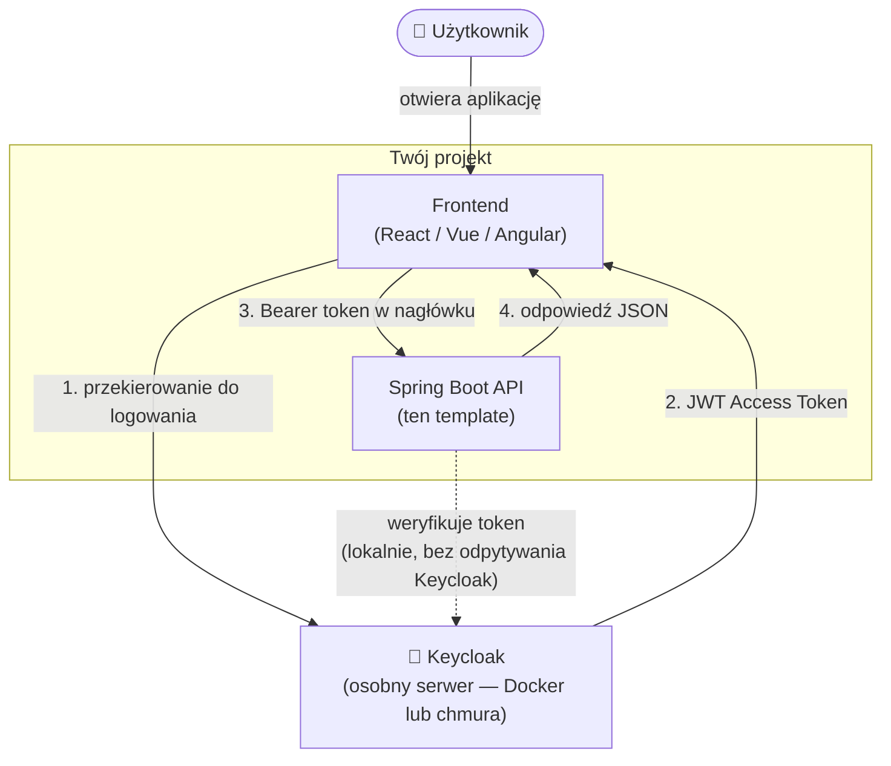

# Spring Boot + Keycloak Template

Gotowy do użycia template REST API z integracją Keycloak przez **Spring Security OAuth2 Resource Server (JWT)**.

---

## Co to jest Keycloak i po co mi to? (dla początkujących)

### Problem, który rozwiązuje Keycloak

Wyobraź sobie, że budujesz aplikację webową. Użytkownicy muszą się logować. Musisz zatem:

- przechowywać hasła (bezpiecznie, z hashowaniem)
- obsługiwać reset hasła przez e-mail
- blokować konta po zbyt wielu błędnych próbach logowania
- może dodać logowanie przez Google / GitHub?
- może dwuskładnikowe uwierzytelnianie (2FA)?
- a jak masz kilka aplikacji — każda ma osobny system logowania?

To setki godzin pracy i dziesiątki sposobów, żeby popełnić błąd bezpieczeństwa.

**Keycloak rozwiązuje to wszystko out-of-the-box.** To gotowy serwer uwierzytelniania (tzw. Identity Provider), który przejmuję cały ten ciężar. Twoja aplikacja pyta Keycloak „czy ten użytkownik jest zalogowany i jakie ma prawa?" — i tyle.

---

### Jak to działa — krok po kroku

```
Użytkownik → Twoja aplikacja → "Zaloguj się" → Keycloak (strona logowania)
                                                      ↓
                                              Użytkownik wpisuje login/hasło
                                                      ↓
                                         Keycloak wystawia TOKEN (JWT)
                                                      ↓
Użytkownik → Twoja aplikacja → wysyła token → aplikacja weryfikuje → dostęp
```

**Token JWT** to zaszyfrowany ciąg znaków, który zawiera informacje o użytkowniku (kto to jest, jakie ma role). Twoja aplikacja Spring Boot nie musi pytać Keycloak przy każdym żądaniu — sprawdza token lokalnie, kryptograficznie.

---

### Słowniczek — kluczowe pojęcia

| Pojęcie | Co to znaczy po ludzku |
|---|---|
| **Realm** | Izolowane środowisko / „tenant". Jak osobna baza użytkowników. Jeden Keycloak może mieć wiele Realmów (np. jeden dla klientów, jeden dla pracowników). |
| **Client** | Twoja aplikacja zarejestrowana w Keycloak. Każda aplikacja to osobny Client. Keycloak musi wiedzieć, kto pyta o tokeny. |
| **Client Secret** | Hasło Twojej aplikacji — dowód, że to naprawdę ona pyta o token, a nie ktoś obcy. Trzymaj w tajemnicy (`.env`). |
| **Access Token** | Krótkożyjący token (domyślnie 5 min) dołączany do każdego żądania HTTP jako `Bearer`. Zawiera dane użytkownika i jego role. |
| **Refresh Token** | Długożyjący token (domyślnie 30 min) służący do pobierania nowego Access Tokena bez ponownego logowania. |
| **Role** | Uprawnienia użytkownika, np. `admin`, `user`, `moderator`. Twoja aplikacja sprawdza role i decyduje, co użytkownik może zobaczyć. |
| **JWT** | Format tokena — to po prostu JSON zakodowany w Base64 i podpisany kryptograficznie. Możesz podejrzeć zawartość na [jwt.io](https://jwt.io). |
| **OIDC / OAuth2** | Standardy protokołów, na których opiera się Keycloak. Spring Security obsługuje je natywnie — nie musisz ich rozumieć w szczegółach. |

---

### Jak Keycloak pasuje do Twojego projektu?



Keycloak stoi z boku — nie jest częścią Twojej aplikacji. Możesz go uruchomić lokalnie (Docker), na VPS, albo użyć chmurowej wersji zarządzanej.

---

### Konfiguracja Keycloak — szczegółowy przewodnik (krok po kroku)

#### Krok 1 — Uruchom Keycloak

```bash
docker compose up -d
```

Otwórz `http://localhost:8180/admin` i zaloguj się: `admin` / `admin`.

---

#### Krok 2 — Utwórz Realm

Realm = izolowane środowisko dla Twojej aplikacji.

1. Kliknij rozwijane menu w lewym górnym rogu (domyślnie pokazuje `master`)
2. Kliknij **Create realm**
3. Wpisz nazwę, np. `myrealm`
4. Kliknij **Create**

> Realm `master` jest dla adminów Keycloak — **nie używaj go** dla swojej aplikacji.

---

#### Krok 3 — Utwórz Client (Twoja aplikacja)

1. W menu po lewej: **Clients** → **Create client**
2. Wypełnij:
   - **Client ID**: `myclient` (dowolna nazwa, zapamiętaj ją)
   - **Client type**: `OpenID Connect`
3. Kliknij **Next**
4. Włącz **Client authentication** (przełącznik na ON) — to tryb confidential (z secret)
5. Kliknij **Next**, potem **Save**
6. Przejdź do zakładki **Credentials** → skopiuj **Client secret** — to Twój `KEYCLOAK_CLIENT_SECRET`

---

#### Krok 4 — Utwórz użytkownika

1. W menu: **Users** → **Create new user**
2. Wpisz **Username**, np. `jan`
3. Wpisz **Email**, np. `jan@test.pl` ← **wymagane!** (bez emaila konto jest "not fully set up" i logowanie nie działa)
4. Kliknij **Create**
5. Przejdź do zakładki **Credentials** → **Set password**
6. Wpisz hasło, wyłącz opcję **Temporary** → **Save password**

---

#### Krok 5 — (Opcjonalnie) Utwórz role i przypisz do użytkownika

Role pozwalają ograniczać dostęp do części aplikacji (`@PreAuthorize("hasRole('admin')")`).

1. W menu: **Realm roles** → **Create role**
2. Wpisz nazwę, np. `admin` → **Save**
3. Wróć do **Users** → wybierz swojego użytkownika → zakładka **Role mapping**
4. Kliknij **Assign role** → wybierz `admin` → **Assign**

---

#### Krok 6 — Wypełnij `.env` i uruchom aplikację

```env
KEYCLOAK_SERVER_URL=http://localhost:8180
KEYCLOAK_REALM=myrealm
KEYCLOAK_CLIENT_ID=myclient
KEYCLOAK_CLIENT_SECRET=<secret z kroku 3>
```

```bash
./mvnw spring-boot:run
```

---

#### Krok 7 — Przetestuj działanie

Pobierz token:

**Windows (PowerShell):**
```powershell
$token = (Invoke-RestMethod -Method Post -Uri http://localhost:8080/api/auth/token -ContentType "application/json" -Body '{"username":"jan","password":"tajne"}').access_token
```

**Linux / macOS / Git Bash:**
```bash
TOKEN=$(curl -s -X POST http://localhost:8080/api/auth/token -H "Content-Type: application/json" -d '{"username":"jan","password":"tajne"}' | jq -r .access_token)
```

Wywołaj chroniony endpoint z tokenem:

**Windows (PowerShell):**
```powershell
Invoke-RestMethod -Uri http://localhost:8080/api/user/me -Headers @{ Authorization = "Bearer $token" }
```

**Linux / macOS / Git Bash:**
```bash
curl http://localhost:8080/api/user/me -H "Authorization: Bearer $TOKEN"
```

Powinieneś zobaczyć dane swojego użytkownika. Gratulacje — integracja działa!

---

### Najczęstsze błędy początkujących

| Błąd | Przyczyna | Rozwiązanie |
|---|---|---|
| `401 Unauthorized` | Brak tokena lub token wygasł | Pobierz nowy token przez `/api/auth/refresh` |
| `403 Forbidden` | Użytkownik nie ma wymaganej roli | Przypisz rolę w Keycloak → Users → Role mapping |
| `Connection refused` do Keycloak | Keycloak nie działa | `docker compose up -d` i poczekaj ~30s |
| Token się nie weryfikuje | Zły `issuer-uri` w `application.yml` | Sprawdź czy URL i nazwa realmu są identyczne |
| `Client secret` nie pasuje | Zły secret w `.env` | Skopiuj ponownie z Keycloak → Clients → Credentials |
| `Account is not fully set up` | Użytkownik nie ma ustawionego emaila | Users → edytuj użytkownika → wpisz Email → Save |

---

## Stack

| Technologia | Wersja |
|---|---|
| Java | 21+ (testowane na 25) |
| Spring Boot | 3.3.5 |
| Spring Security | 6.x |
| Keycloak | 25.x |

---

## Szybki start

### 1. Uruchom Keycloak lokalnie

```bash
docker compose up -d
```

Keycloak dostępny pod: `http://localhost:8180`  
Admin: `admin` / `admin`

### 2. Skonfiguruj Keycloak

W panelu admina (`http://localhost:8180/admin`):

1. **Utwórz Realm** → np. `myrealm`
2. **Utwórz Client** → `myclient`
   - Client authentication: **ON** (confidential)
   - Valid redirect URIs: `http://localhost:8080/*`
   - Skopiuj **Client Secret** z zakładki *Credentials*
3. **Utwórz użytkownika** → ustaw hasło w zakładce *Credentials*
4. (Opcjonalnie) **Utwórz Role** → przypisz do użytkownika

### 3. Skonfiguruj aplikację

```bash
cp .env.example .env
# Wypełnij wartości w .env
```

```env
KEYCLOAK_SERVER_URL=http://localhost:8180
KEYCLOAK_REALM=myrealm
KEYCLOAK_CLIENT_ID=myclient
KEYCLOAK_CLIENT_SECRET=<twój-secret>
```

### 4. Uruchom aplikację

```bash
./mvnw spring-boot:run
```

---

## Endpointy

| Metoda | URL | Auth | Opis |
|---|---|---|---|
| GET | `/api/public/health` | ✗ | Health check |
| GET | `/api/user/me` | JWT | Dane zalogowanego użytkownika |
| GET | `/api/user/admin-only` | JWT + role `admin` | Przykład RBAC |
| POST | `/api/auth/token` | ✗ | Pobierz token (dev only) |
| POST | `/api/auth/refresh` | ✗ | Odśwież token |
| POST | `/api/auth/logout` | ✗ | Wyloguj / unieważnij token |

---

## Jak pobrać token

**Windows (PowerShell):**
```powershell
$token = (Invoke-RestMethod -Method Post -Uri http://localhost:8080/api/auth/token -ContentType "application/json" -Body '{"username":"jan","password":"tajne"}').access_token
Invoke-RestMethod -Uri http://localhost:8080/api/user/me -Headers @{ Authorization = "Bearer $token" }
```

**Linux / macOS / Git Bash:**
```bash
TOKEN=$(curl -s -X POST http://localhost:8080/api/auth/token -H "Content-Type: application/json" -d '{"username":"jan","password":"tajne"}' | jq -r .access_token)
curl http://localhost:8080/api/user/me -H "Authorization: Bearer $TOKEN"
```

---

## Struktura projektu

```
src/
├── main/java/com/example/keycloaktemplate/
│   ├── KeycloakTemplateApplication.java
│   ├── config/
│   │   └── SecurityConfig.java          ← konfiguracja Spring Security
│   ├── security/
│   │   ├── KeycloakJwtConverter.java    ← mapowanie ról z JWT na GrantedAuthority
│   │   └── CurrentUser.java             ← model zalogowanego użytkownika
│   ├── controller/
│   │   ├── AuthController.java          ← token / refresh / logout proxy
│   │   ├── UserController.java          ← /me i przykład RBAC
│   │   └── PublicController.java        ← publiczne endpointy
│   └── exception/
│       └── GlobalExceptionHandler.java  ← RFC 9457 ProblemDetail błędy
└── resources/
    └── application.yml
```

---

## Jak działają role

Keycloak wpisuje role użytkownika do tokena JWT przy jego wystawieniu:

```json
"realm_access": {
  "roles": ["admin", "user", "offline_access"]
}
```

Spring Boot **nie pyta Keycloaka przy każdym requeście** — role są już w tokenie. `KeycloakJwtConverter` wyciąga je i zamienia na `ROLE_admin`, `ROLE_user` itd. Dzięki temu `@PreAuthorize` działa lokalnie, bez żadnych requestów sieciowych.

Chcesz sprawdzić co siedzi w Twoim tokenie? Wklej go na [jwt.io](https://jwt.io).

---

## Ochrona endpointów przez role

```java
@GetMapping("/api/orders")
@PreAuthorize("hasRole('user')")
public ResponseEntity<List<Order>> getOrders(@AuthenticationPrincipal Jwt jwt) {
    String userId = jwt.getSubject(); // UUID użytkownika z Keycloaka
    // ...
}

// Więcej opcji:
@PreAuthorize("hasRole('admin')")                        // jedna rola
@PreAuthorize("hasAnyRole('admin', 'moderator')")        // jedna z wielu
@PreAuthorize("hasRole('admin') and hasRole('manager')") // obie naraz
```

Użytkownik bez wymaganej roli dostanie `403 Forbidden`.

---

## Zarządzanie użytkownikami przez API (Keycloak Admin REST API)

Keycloak udostępnia REST API do zarządzania użytkownikami — możesz tworzyć konta programistycznie, bez wchodzenia w panel admina.

### Pobierz token admina

```bash
ADMIN_TOKEN=$(curl -s -X POST http://localhost:8180/realms/master/protocol/openid-connect/token \
  -d "grant_type=password&client_id=admin-cli&username=admin&password=admin" | jq -r .access_token)
```

**Windows (PowerShell):**
```powershell
$adminToken = (Invoke-RestMethod -Method Post -Uri http://localhost:8180/realms/master/protocol/openid-connect/token -ContentType "application/x-www-form-urlencoded" -Body "grant_type=password&client_id=admin-cli&username=admin&password=admin").access_token
```

### Utwórz użytkownika przez API

```bash
curl -s -X POST http://localhost:8180/admin/realms/myrealm/users \
  -H "Authorization: Bearer $ADMIN_TOKEN" \
  -H "Content-Type: application/json" \
  -d '{
    "username": "marek",
    "email": "marek@test.pl",
    "firstName": "Marek",
    "lastName": "Nowak",
    "enabled": true,
    "emailVerified": true,
    "credentials": [{"type":"password","value":"haslo123","temporary":false}]
  }'
```

**Windows (PowerShell):**
```powershell
Invoke-RestMethod -Method Post -Uri http://localhost:8180/admin/realms/myrealm/users `
  -Headers @{ Authorization = "Bearer $adminToken" } `
  -ContentType "application/json" `
  -Body '{"username":"marek","email":"marek@test.pl","firstName":"Marek","lastName":"Nowak","enabled":true,"emailVerified":true,"credentials":[{"type":"password","value":"haslo123","temporary":false}]}'
```

> **Ważne:** ustaw `"emailVerified": true` — bez tego konto jest "not fully set up" i logowanie nie zadziała.

### Zaloguj użytkownika (pobierz token)

```bash
TOKEN=$(curl -s -X POST http://localhost:8080/api/auth/token \
  -H "Content-Type: application/json" \
  -d '{"username":"marek","password":"haslo123"}' | jq -r .access_token)
```

**Windows (PowerShell):**
```powershell
$token = (Invoke-RestMethod -Method Post -Uri http://localhost:8080/api/auth/token -ContentType "application/json" -Body '{"username":"marek","password":"haslo123"}').access_token
```

### Wywołaj chroniony endpoint

```bash
curl http://localhost:8080/api/user/me -H "Authorization: Bearer $TOKEN"
```

**Windows (PowerShell):**
```powershell
Invoke-RestMethod -Uri http://localhost:8080/api/user/me -Headers @{ Authorization = "Bearer $token" }
```

---

## Testy

```bash
./mvnw test
```

Testy używają `MockMvc` z `spring-security-test` — **nie wymagają działającego Keycloak**.

---

## Zmiana package name

Zamień `com.example.keycloaktemplate` na swoją paczkę we wszystkich plikach Java.
